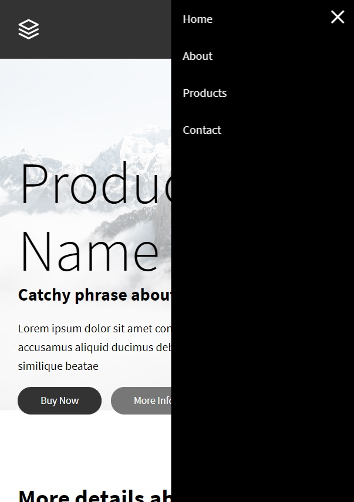

  <section class="content">
    <h1 id="skill">{{ page.title }}</h1>
    <figure>
      
      <figcaption>Calgary Crime API</figcaption>
    </figure>
    <figure>
      
      <figcaption>JS Hamburger Menu</figcaption>
    </figure>
    <figure>
      
      <figcaption>Coming Soon</figcaption>
    </figure>
    <figure>
    
    <figcaption>Coming Soon</figcaption>
    </figure>
  </section>